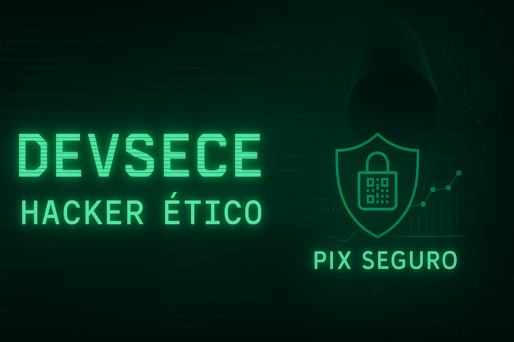

<h1 align="center">🧠 Devsecec | Hacker Ético em Formação 🛡️</h1>

  

  

---

💻 **Projetos em Destaque**

- 🔍 [`Pix Seguro`](https://github.com/Devsecec/Pix-Seguro)  
  Verificador de QR Codes falsos para evitar golpes em pagamentos Pix.

- 🌐 [`KAGM WebSec`](https://github.com/Devsecec/KAGM-WebSec)  
  Site de e-commerce vulnerável para treinamento ofensivo.

- 📡 [`NetSecScanner`](https://github.com/Devsecec/NetSecScanner)  
  Scanner de rede com testes de segurança e análise automatizada.

- 🔐 [`Scripts`](https://github.com/Devsecec/Scripts)  
  Hardening Linux, análise com Lynis, Scan Nmap + Relatório automático.

---

🛠️ **Skills**
    Linux Mint / kali linux

    Python (automação, análise de rede)

    Bash scripting

    Nmap, Lynis, Wireshark, Nikto

    Streamlit, Flask

    Git & GitHub

---

📚 **Estudando Agora**
- Cibersegurança prática e ofensiva
- Engenharia reversa e análise de malware
- Desenvolvimento seguro com Python e Flutter
- Participação em CTFs e labs Hack The Box

---

📫 **Contato**
- [LinkedIn](https://www.linkdin.com/in/afael-santos-b131) 
- Email: devsecec@protonmail.com
- GitHub: [Devsecec](https://github.com/Devsecec)

